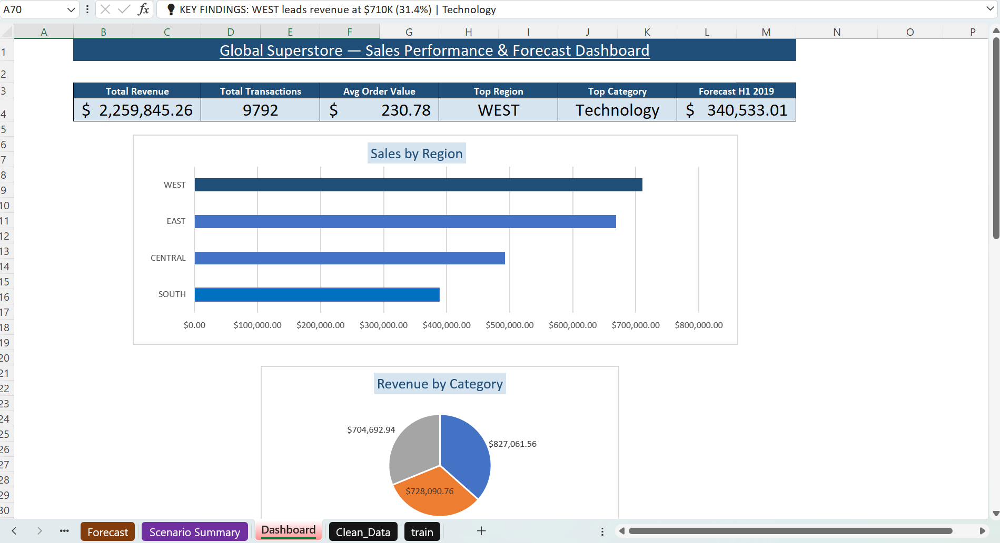
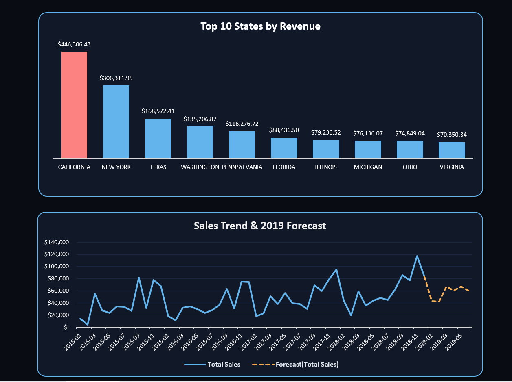
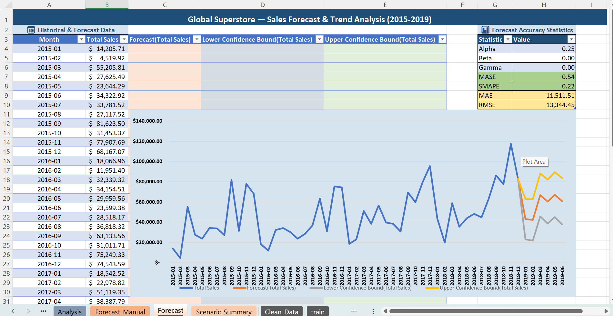
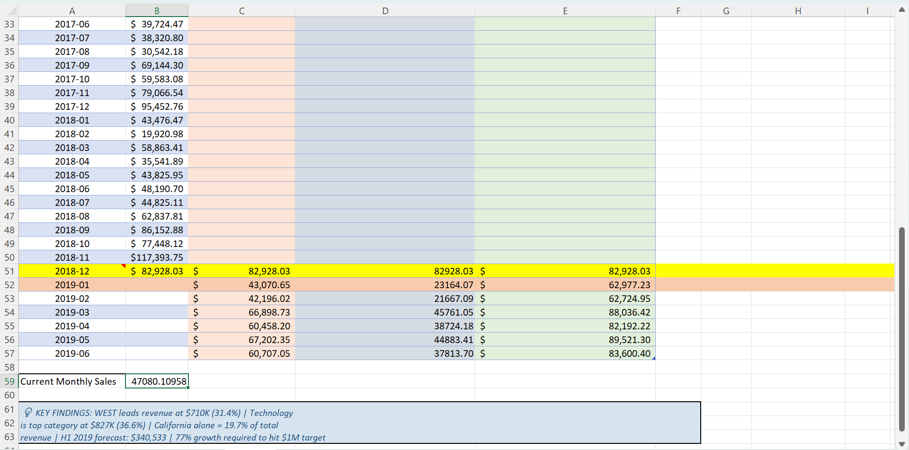
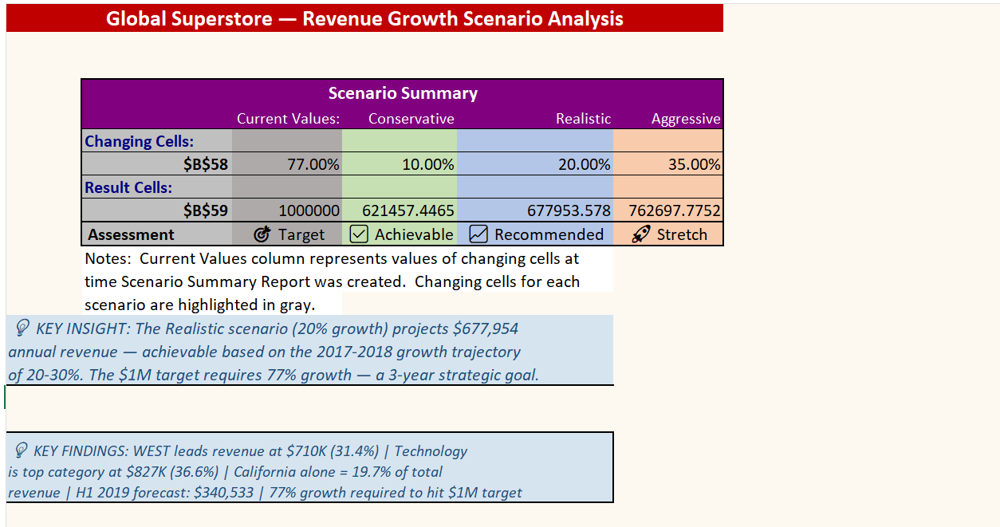

# 🛒 Global Superstore — Sales Performance & Forecast Dashboard

##  Project Overview
Analysis of 9,792 retail transactions across 4 years (2015-2018) 
identifying sales performance patterns, regional concentration, 
product category trends and forecasting H1 2019 revenue.

##  Key Findings
- **Total Revenue:** $2,259,845 across 9,792 transactions
- **Top Region:** WEST at $710,117 (31.4% of total)
- **Top Category:** Technology at $827,062 (36.6% of total)
- **California** alone = 19.7% of total revenue
- **Top 10 states** = 69.1% of all revenue
- **H1 2019 Forecast:** $340,533 (FORECAST.ETS, MASE=0.54)
- **$1M target** requires 77% growth — 3-year strategic goal

## 🛠️ Advanced Skills Demonstrated
| Skill | Application |
|---|---|
| Power Query | Date locale fix, calculated columns, 9,800 rows |
| Dynamic Arrays | UNIQUE, SORT, FILTER, interactive dropdown |
| FORECAST.ETS | 6-month forecast with confidence bounds |
| Scenario Manager | Conservative/Realistic/Aggressive growth |
| Goal Seek | Reverse engineered $1M revenue target |
| Pivot Tables | 5 analyses including Top 10 States filter |
| SUMPRODUCT | Monthly sales aggregation across 48 months |
| Dashboard Design | 6 KPI cards, 4 charts, key findings panel |

## 📁 Project Structure
| Sheet | Purpose |
|---|---|
| train | Original Kaggle raw data |
| Clean_Data | Power Query cleaned 9,792 rows |
| Dynamic_Tables | UNIQUE/SORT/FILTER dynamic arrays |
| Analysis | 5 Pivot Table analyses |
| Forecast | FORECAST.ETS with accuracy statistics |
| Scenario Summary | 3-scenario What-If analysis |
| Dashboard | Executive presentation |

## 📈 Forecast Accuracy
| Metric | Value | Interpretation |
|---|---|---|
| MASE | 0.54 | 46% better than baseline ✅ |
| SMAPE | 0.22 | 22% average error |
| MAE | $11,511 | Average monthly miss |

  
- Scenario Summary
  
## 💡 Business Recommendations
1. Prioritize WEST region — highest revenue concentration
2. Invest in Technology category — clear market leader
3. Develop South region — significant growth opportunity
4. California dependency is a risk — diversify geographic focus
5. Realistic 20% growth target achievable based on 2017-2018 trajectory

## 📊 Data Source
Kaggle — [Superstore Sales Dataset](https://www.kaggle.com/datasets/rohitsahoo/sales-forecasting) (9,800 transactions, 2015-2018)

## 👤 Author
**NC-Dan (Duncan Chicho)** | Data Analyst | Open to remote Contribution  
## | Other Analyst Projects |  
- 🔗[Kenya Healthcare Analytics — Patient Admission, Cost Analysis & Risk Dashboard](https://github.com/NC-Dan/healthcare-analytics-dashboard)
- 🔗[Kenya Banking Risk Dashboard](https://github.com/NC-Dan/kenya-banking-risk-dashboard)
- 🔗[www.linkedin.com/in/duncan-analytics](https://www.linkedin.com/in/duncan-analytics/)
